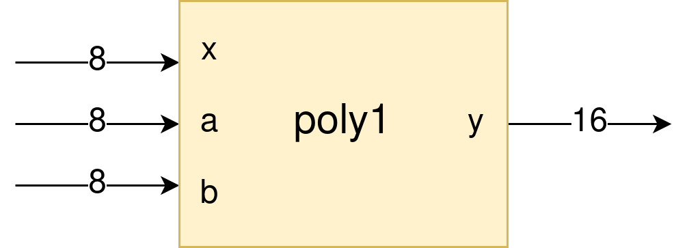

Basic tutorial
==============

This basic tutorial covers the basic functions of the MAxPy framework. By the end of it, you will be able to understand how MAxPy works and its available tools. Then, you can use the framework to develop and optimize your own circuits.

The code used for this tutorial is available `here <https://github.com/MAxPy-Project/MAxPy-Tutorial>`_.

The problem
-----------

Suppose you want to make a hardware accelerator for a Polynomial Function of Degree 1: a *linear function*. The operation is pretty straightforward: the :math:`y(x)` output for any given :math:`x` input is the factor :math:`a` times the :math:`x` input plus factor :math:`b`, as shown in the equation below.

.. math::
   y(x) = a.x + b

As the equation shows, we can see that the linear function is performed by two arithmetic operations: *one sum* and *one multiplication*.

Now we are going to make some assumptions for our application:

* From now on, we will call our linear function circuit as *poly1*.
* The circuit is going to have 3 inputs (*x*, *a* and *b*), and only one output (*y*);
* Each of the three inputs will be *8 bits wide*, being the MSB the *signal bit* (values ranging from -128 to 127);
* To cover all possibilites for data inputs, the output will be *16 bit wide*;
* The application in which the linear function hardware accelerator will be used tolerates an error range of *10%*.

Taking these assumptions into account, we can draw the following block diagram which represents our hardware accelerator:

|

The RTL design
--------------

Let's write the *Verilog description* of our linear function hardware accelerator. Create anywhere in your system a directory called ``poly1``, in which will put all design files used in this tutorial. From now on, we will call this the *working directory*. Inside the working directory, create a subdirectory named ``rtl``, and create a new text file called ``poly1.v``.

::

    poly1
    └── rtl
        └── poly1.v

The following code is the hardware description of our circuit, written in Verilog:

.. code-block:: verilog

    module poly1(a, b, x, y);
        input [7:0] a, b, x;
        output [15:0] y;
        assign y = a*x + b;
    endmodule

Compiling with MAxPy
--------------------

Now we are going to compile the *poly1* module in MAxPy, but without any optimizations or approximations for now. The goal at this point is to make a functional module that we can use to write our testbench.

Create a ``run1.py`` file inside the working directory:

::

    poly1
    ├── rtl
    │   └── poly1.v
    └── run1.py

The ``run1.py`` is a Python script, which will be used to invoke MAxPy's command. The content of the ``run1.py`` is the following:

.. code-block:: python

    from MAxPy import maxpy
    circuit = maxpy.AxCircuit(top_name="poly1")
    circuit.rtl2py(target="exact")

Now it's time to run MAxPy's command! Run the following lines in the terminal:

.. code:: bash

	cd [PATH_TO_WORKING_DIR]/poly1
	python run1.py

If everything is fine, you should see a terminal output like the following. In case of any error, please check the :doc:`installation` section and review every step of this tutorial.

::

    MAxPy - Version 0.0.1

    ------------------------------------------------------------------------------------
    >>> MAxPy rtl2py: converting Verilog RTL design "poly1" into Python module
    > Base "rtl", Target "exact"
    > Start: 04-03-2023 22:48:39
    > Synth
    > Netlist estimated area: 110.887
    > Netlist estimated power = 5.066 uW
    > Netlist estimated maximum delay = 127.195 nS
    > Verilator
    > C++/Python Wrapper
    > C++ compilation
    ninja: Entering directory `poly1_exact/'
    [11/11] Linking CXX shared module poly1.cpython-310-x86_64-linux-gnu.so
    >> 3.8 seconds
    > Module check (should print module's name)
    > poly1
    > End: 04-03-2023 22:48:43
    >>> Circuit "poly1" converted successfully!

Writing the testbench
---------------------

Exploring approximate adders
----------------------------

Exploring approximate multipliers
---------------------------------

Using probabilistic pruning
---------------------------

.. .. code-block:: console
..
..     (.venv) $ pip install lumache
..
.. Creating recipes
.. ----------------
..
.. To retireve a list of random ingredients, you can use the ``lumache.get_random_ingredients()`` function:
..
.. .. autofunction:: lumache.get_random_ingredients
..
..
.. The ``kind`` parameter should be either ``"meat"``, ``"fish"``, or ``"veggies"``. Otherwise, :py:func:`lumache.get_random_ingredients` will raise an exception.
..
.. .. autoexception:: lumache.InvalidKindError
..
.. >>> import lumache
.. >>> lumache.get_random_ingredients()
.. ['shells', 'gorgonzola', 'parsley']
