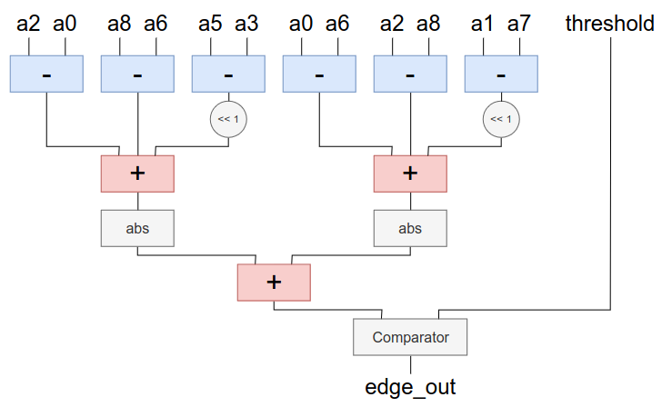

Case Study: Sobel Edge Detection
================================

This tutorial presents a more advanced tutorial for an actual application. Here we are going to focus more on the application and less on the MAxPy instructions.

The circuit studied here is an Approximate Sobel Operator used for Edge Detection in images. You can check the code for this study case `here <https://github.com/MAxPy-Project/AxSobel>`_.

Sobel Basics
------------

The *Sobel Operator* is used digital processing of images as an approximation to the *Gradient Filter*, which is needed in edge detection applications. It is composed by two *3x3* convolution masks, each representing the pixel gradient in both :math:`x` and :math:`y` directions. The below equation show the convolution masks used in the Sobel Operator.

.. math::
   \nabla x =
    1/4
    \begin{bmatrix}
        1 & 2 & 1\\
        0 & 0 & 0\\
        -1 &-2 & -2\\
    \end{bmatrix}
    *
    \begin{bmatrix}
        a0 & a1 & a2\\
        a3 & a4 & a5\\
        a6 & a7 & a8\\
    \end{bmatrix}

.. math::
    \nabla y =
    1/4
    \begin{bmatrix}
        1 & 0 & -1\\
        2 & 0 & -2\\
        1 & 0 & -1\\
    \end{bmatrix}
    *
    \begin{bmatrix}
        a0 & a1 & a2\\
        a3 & a4 & a5\\
        a6 & a7 & a8\\
    \end{bmatrix}

For any give point of an image, the gradient's magnitude is defined as following:

.. math::
    \lvert \nabla A  \rvert = \sqrt{(Hx\times A)^2 + (Hy\times A)^2}

To reduce circuitry complexity, the *gradient value* can be approximated by the sum of the :math:`x` and :math:`y` components absolute values. This sum is then compared to an *input threshold value*, defining whether or not the given pixel represents an edge.

The image below depicts a block diagram for the Sobel Operator circuit. There we have 8 inputs for the pixels surrounding the pixel of interest (``a0`` to ``a8``, skipping ``a4``), one ``theshold`` input for the *edge detection threshold*, and an ``edge_out`` output, indicating if the pixel of interest is an edge or not.

Quality Metrics
---------------

In this application, we are going to generate full images containing the edges of the original sample images. We need then compare the edge images generated by our Sobel Operator to the ones generated by a reliable reference, such as `OpenCV <https://docs.opencv.org/3.4/d2/d2c/tutorial_sobel_derivatives.html>`_. For image comparisson, we have choosen the *Structural Simmilarity Index* - the **SSIM** - as a *quality metric*. The SSIM can be defined as in the equation below, and there's a Python implementation in the `scikit-image toolbox <https://scikit-image.org/docs/dev/api/skimage.metrics.html>`_.

.. math::
    SSIM(x,y) = \frac{(2\mu_x\mu_y + c_1)\times(2\sigma_{xy} + c_2)}{(\mu_x^2 + \mu_y^2 + c_1)\times(\sigma_x^2 + \sigma_y^2 + c_2)}

Also, as we are getting *boolean values* for each pixel, we can check the *accuracy of edge detection* using the **Accuracy Score** defined in the equation bellow, where :math:`t_p` is *true positive* count, :math:`t_n` is *true negative* count, :math:`f_p` if *false positive* count and :math:`f_n` is *false negative* count.

.. math::
    Accuracy = \frac{t_p + t_n}{t_p + f_p + t_n + f_n} \times 100

RTL Exact Description
---------------------

Now let's get to the circuit description. The following code shows the *Verilog description* of the block diagram above with no further approximations other than the Sobel Operator already is compared to the *Gradient Filter*.

.. code-block:: verilog

    module sobel_gradient(a1, a2, b1, b2, c1, c2, grad);
        input [7:0] a1, a2, b1, b2, c1, c2;
        output [10:0] grad;
        wire signed [8:0] g1, g2, g3;
        wire signed [9:0] g13, g22;
        wire signed [10:0] g;
        assign g1 = {1'b0, a1} - {1'b0, a2};
        assign g2 = {1'b0, b1} - {1'b0, b2};
        assign g3 = {1'b0, c1} - {1'b0, c2};
        assign g13 = g1 + g3;
        assign g22 = g2 * 9'd2;
        assign g = g13 + g22;
        assign grad = g[10] ? ~g+11'd1 : g;
    endmodule

    module sobel(p0, p1, p2, p3, p5, p6, p7, p8, threshold, edge_out);
        input [7:0] p0,p1,p2,p3,p5,p6,p7,p8;
        input [7:0] threshold;
        output edge_out;
        wire [10:0] gx, gy;
        wire [11:0] grad;
        sobel_gradient grad_x(p2, p0, p5, p3, p8, p6, gx);
        sobel_gradient grad_y(p0, p6, p1, p7, p2, p8, gy);
        assign grad = gx + gy;
        assign edge_out = grad > {4'd0, threshold} ? 1'b1 : 1'b0;
    endmodule

You can find the full testbench script at this `link <https://github.com/MAxPy-Project/AxSobel/blob/main/testbench.py>`_. After running it with the exact circuit, we get the following results:

Using Approximate Adders
------------------------

Using Probabilistic Pruning
---------------------------

Conclusion
----------
